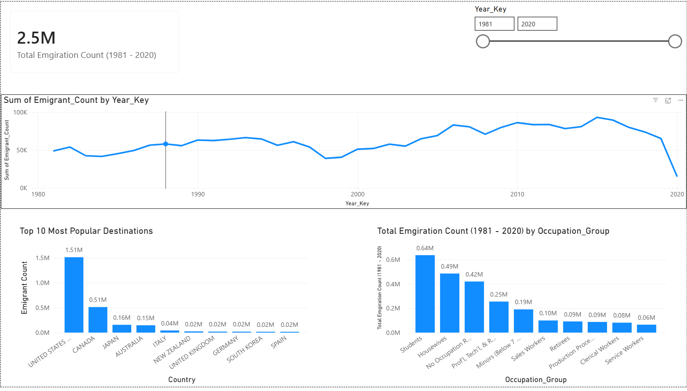
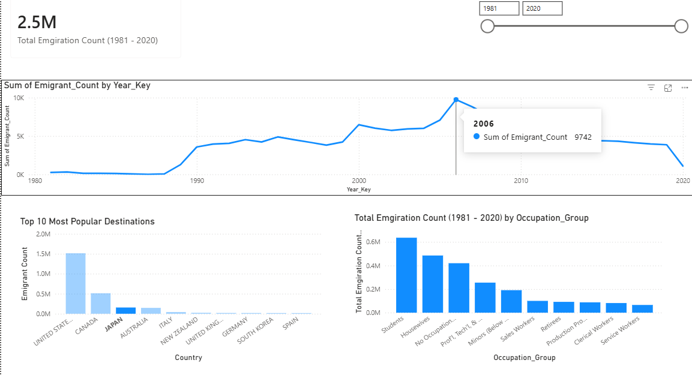
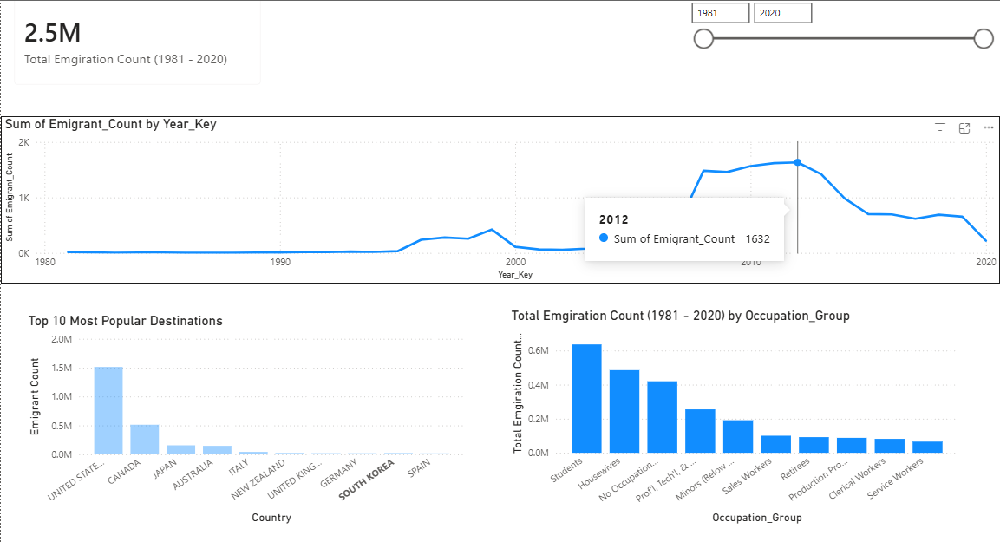

# Filipino Emigration Analaysis Dashboard
A simple end-to-end data analysis project to track the migration patterns of Filipino emigrants. Admittedly, what orginally was supposed to be a detailed analysis turned out to be more focused on data cleaning principles and PowerBI dashboard creation. This project relies heavily on Pandas as the main tool used for data manipulation, getting the data from [data.gov](https://data.gov.ph/index/public/dataset/Commission%20of%20Filipino%20Overseas:%20Statistical%20Profile%20Of%20Registered%20Filipino%20Emigrants%20%5B1981-2020%5D/q8o5akrp-ers2-7hag-m3ds-h7eki6wqhqs9) in the form of xls files. Afterwards, a simple dashboard was created to visualize the data. PowerBI was used here instead of Tableau to focus more on functionailty than aesthetics. 

## Objectives
* To clean "unusual" data and make them into usable tables.
* To find out the common destination and place of origins of filipino emigrants.
* To check the trend of filipino citizens emigrating to other countries.
* To find out the most common occupation amongst the emigrants.

## Tech Stack
* **Python (Pandas and Numpy) & Jupyter Notebooks:** Data Cleaning and Handling Missing Values
* **Power BI:** Interactive Dashboard and Data Modeling

## Key Insights
* **Key Insight 1:**
    * **Data Cleaning**: All of the data used in this project is in the form of .xls files, with headers and tails for each of the sheets. For each of the xls files, they contain different formatting which made it difficult to have a "one size fits all" solution. To address this, I created a utils.py file that contains functions that are applicable for all of the files. The most complex function being clean() as it tackles the most things for each of the data files. In a nutshell, it cleans the headers, drops unnamed rows, fills nulls and converts all of the numerical values (in the year columns) into integers amongst other things.

    

* **Key Insight 2:**
    * Looking at the dashboard, the United States of America is the most popular destination amongst the filipino emigrants, followed by Canada and Japan. Interestingly, some countries have peaks in filipino immigrants (ex. Japan in 2006, South Korea in 2012). The total amount of emigrants tapers off going towards 2020, which is an indicator of the Global COVID-19 Pandemic, creating essential a global shutdown.

  
  

* **Key Insight 3:**
    * Lastly, amongst all of the emigrants, the most common occupation is students. This is directly followed by housewives possibly emigrating with their husbands. And amongst the "employed" group, the most common occupation falls under the professional and technical related workers, which is possibly heavily weighted towards engineers and healthcare professionals.